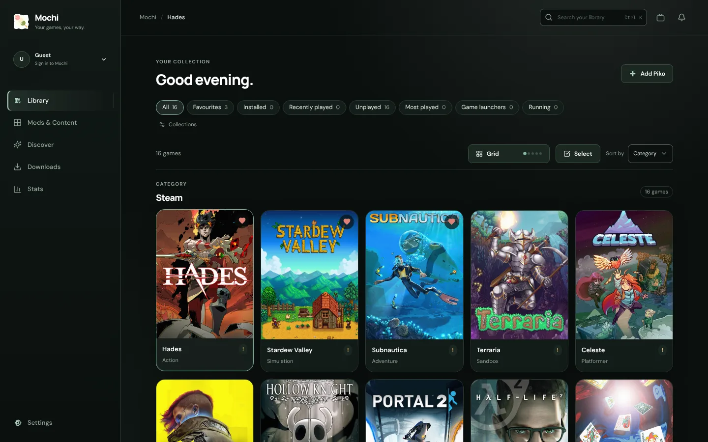
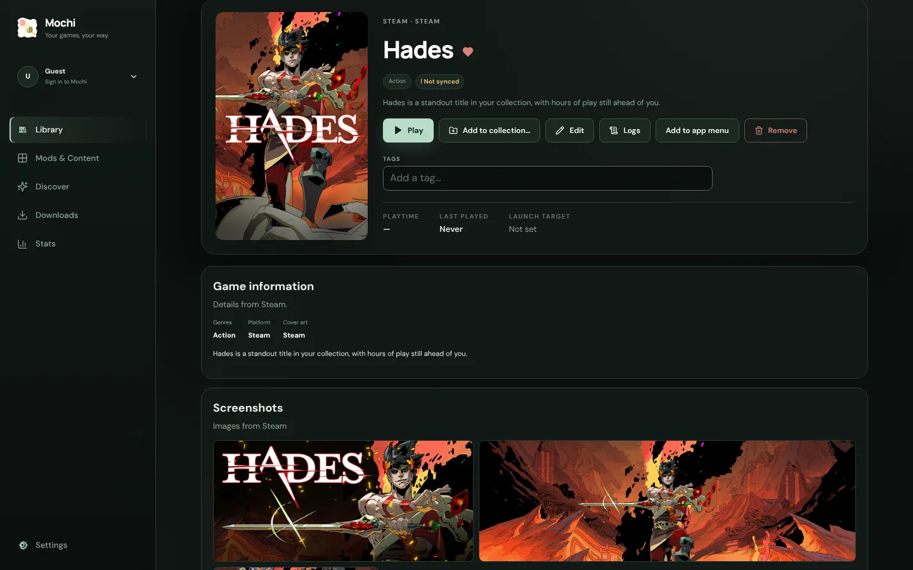
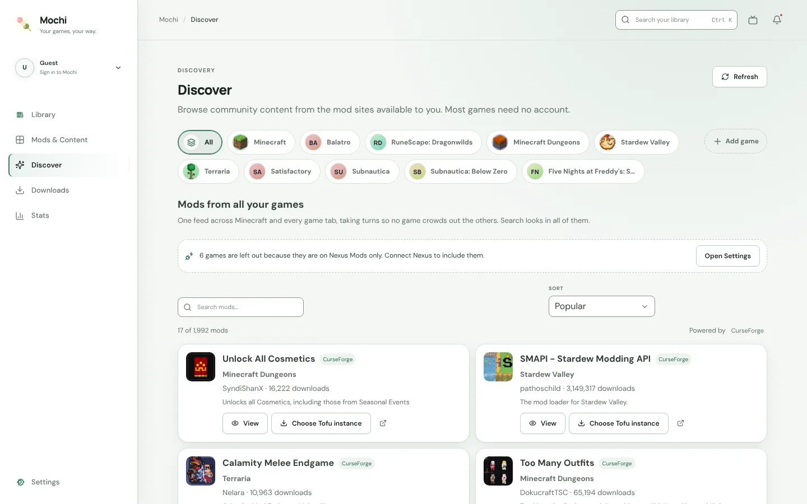
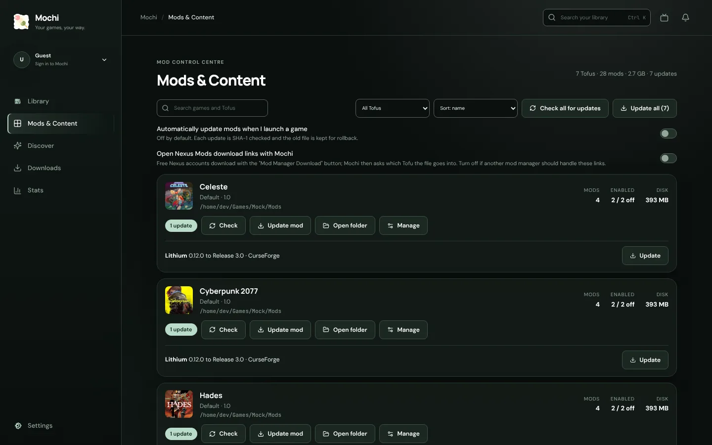
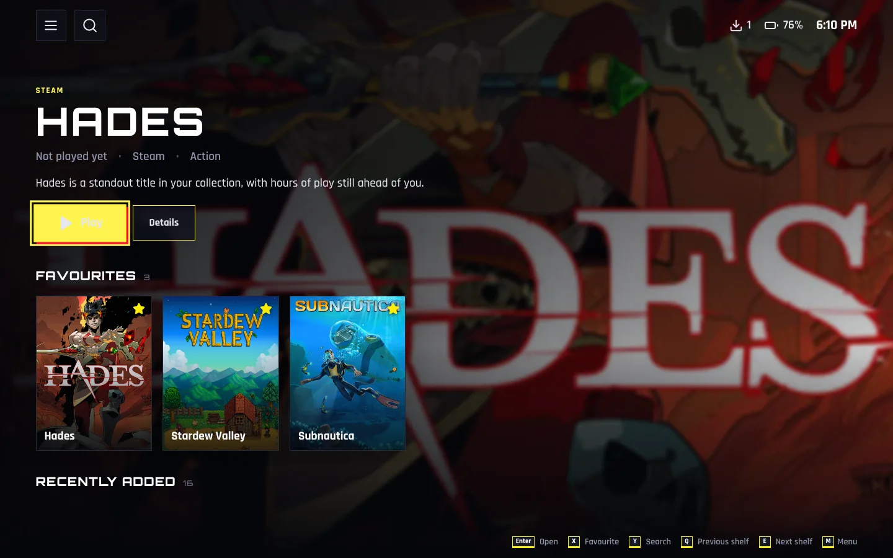
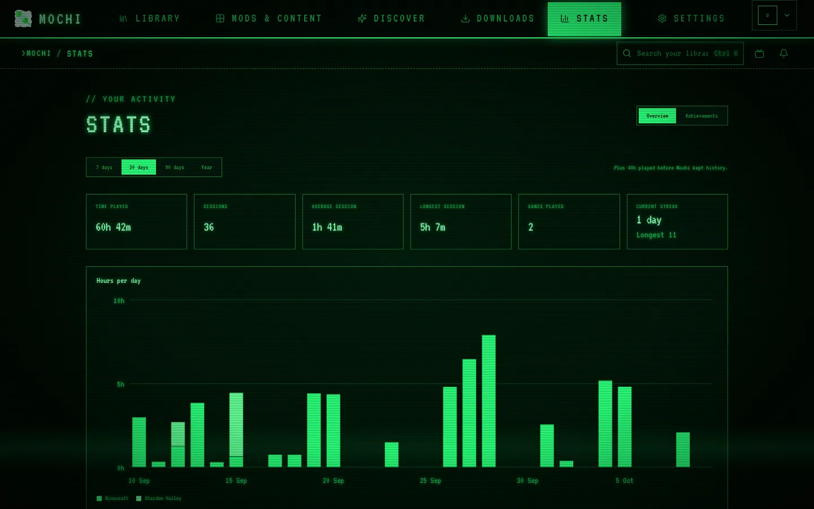
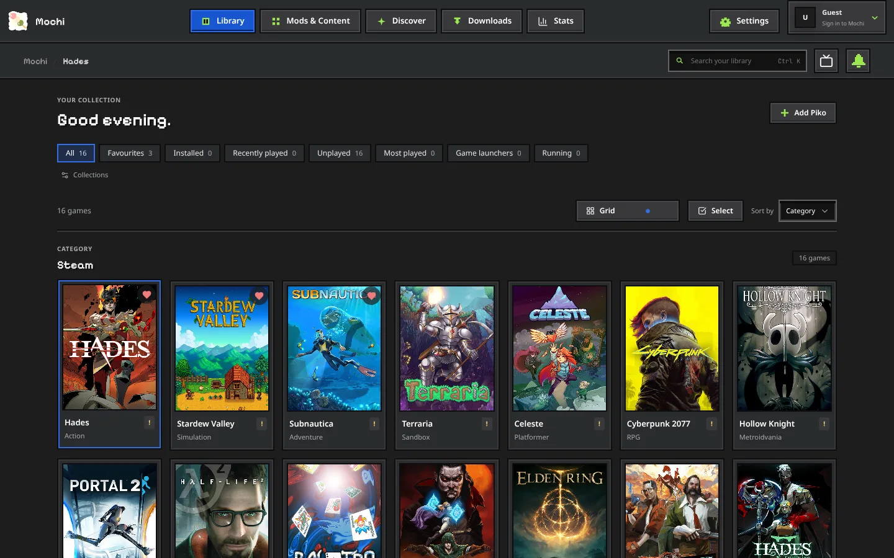
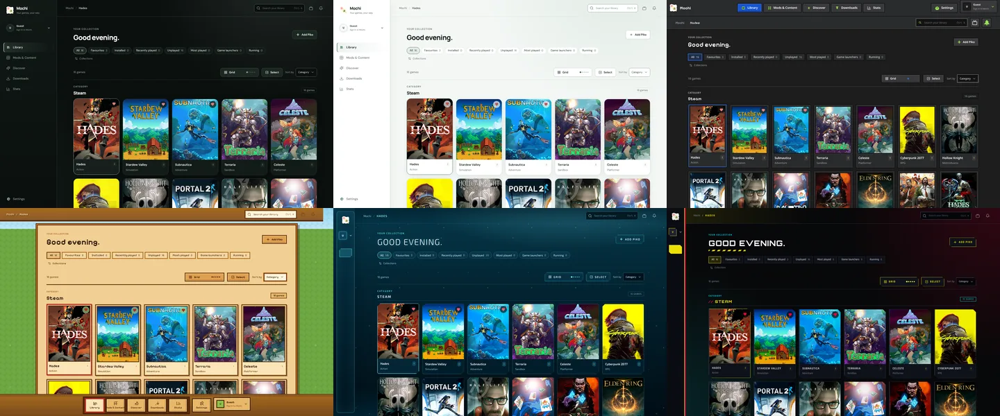

<p align="center">
  
</p>

<h1 align="center">Mochi</h1>

<p align="center">
  <strong>Your games, your way.</strong><br>
  A cross-platform desktop game launcher built around local control, flexible launch targets, and optional cloud metadata.
</p>

<p align="center">
  
  
  
  
  
</p>

<p align="center">
  
</p>

> [!WARNING]
> **Mochi builds are NOT code-signed or notarized.**
>
> - There is no Apple Developer account behind this project. The macOS DMG is **ad-hoc signed only**, so **Gatekeeper will block the first launch**. See [Install](#install) for how to open it.
> - Linux packages (AppImage, deb, rpm) are not platform-signed, but every release file carries a **GPG signature** and a **GitHub build attestation**, and the release lists `SHA256SUMS.txt`. See [Verify your download](#verify-your-download).
> - Only download Mochi from the official [GitHub Releases](https://github.com/T1nkiePlayz/Mochi/releases) page and verify the download before running anything.
> - **Early development:** storage formats, features and UI may change between versions. Do not treat Mochi as the only copy of data you care about (library, collections, playtime history). Keep your own backups.

## Table of contents

- [Overview](#overview)
- [Features](#features)
- [Screenshots](#screenshots)
- [Piko and Tofu](#piko-and-tofu)
- [Importing games and launching](#importing-games-and-launching)
- [Accounts, cloud sync and offline use](#accounts-cloud-sync-and-offline-use)
- [Platform support](#platform-support)
- [Install](#install)
- [Verify your download](#verify-your-download)
- [Security model](#security-model)
- [Current limitations](#current-limitations)
- [Roadmap](#roadmap)
- [Documentation index](#documentation-index)
- [Development](#development)
- [Releasing](#releasing)
- [Contributing](#contributing)
- [License](#license)
## Overview

Mochi is a cross-platform (Linux and macOS) desktop game launcher that sits above existing game ecosystems instead of replacing them. It gives you one library for games that already live on your computer: Steam, Heroic, Epic, itch.io, Flatpak, Lutris, Bottles, Whisky/CrossOver, plain executables, scripts and apps.

- **Local first.** Installations stay where they are; the library, launching, playtime, themes and settings work without an account or a network. Cloud sync is optional and metadata-only.
- **Native where it matters.** React/TypeScript for the UI; Tauri 2 and Rust for launching, discovery, process tracking and downloads. OS-specific code lives in `src-tauri/src/platform/` and `src-tauri/src/sources/`, and the UI asks `get_platform_capabilities` instead of assuming an OS.
- **Easy to verify.** Download from [Releases](https://github.com/T1nkiePlayz/Mochi/releases) only and check it with [Install](#install) and [Verify your download](#verify-your-download).
- **Your launcher stays in charge of its games.** Imported games are launched through the owning launcher (Steam, Heroic, ...) so prefixes, overlays and authentication keep working.

## Features

### Library
- Search across names, descriptions and categories (**Ctrl+K / Cmd+K**), sorting, and a *Continue playing* shelf.
- **Favourites, tags and collections** (user-named, optional emoji, stored per profile) and **smart filters**: All, Favourites, Installed, Recently played, Unplayed, Most played, Launchers, Running now. Filter by source too.
- Per-game page with playtime, Tofus, metadata, screenshots/trailer, Steam achievements and mod management. Screenshots open in a gallery with a lightbox and each set is credited to its real source (IGDB, Steam, SteamGridDB or your own).
- Guided first-launch setup (welcome, account, accessibility, import) and an import picker with per-game selection.
- **Smart game categorisation** separates games from launchers during discovery, and the category can still be corrected later in the game's editor if an item was classified incorrectly.
- Themed "Are you sure?" confirmations for destructive actions.
- In-app notification centre plus desktop notifications (`notify-send` on Linux, `osascript` on macOS).
- **Backlog and wishlist**: mark games Want to play / Playing / Finished / Dropped with notes, keep a wishlist of games you don't own yet, and let *What should I play?* pick by mood and time ([docs/backlog.md](docs/backlog.md)).
- **Duplicate merge**: the same game from several sources (Steam, Heroic, Flatpak, desktop entries) can be merged into one entry with a *Play via* picker, and unmerged at any time ([docs/duplicates.md](docs/duplicates.md)).
- **Command palette** (Ctrl+K / Cmd+K): fuzzy-search games and run actions (theme, settings sections, mods, snapshots, Big Picture); type `>` for actions only ([docs/command-palette.md](docs/command-palette.md)).
- **Per-game launch options**: environment variables, arguments, working directory, Proton/Wine runtime, GameMode, MangoHud and gamescope, with a live preview of the exact command and a ready-to-paste Steam launch option string ([docs/launch-options.md](docs/launch-options.md)).
- **Save backups**: zip snapshots of Minecraft worlds, Steam userdata and any folder you add, with safe restore and automatic backup when a game closes ([docs/save-backups.md](docs/save-backups.md)).
- **Shortcuts**: create desktop shortcuts (Linux menu/Desktop, macOS .app) and add any game to Steam as a non-Steam game ([docs/shortcuts.md](docs/shortcuts.md)).
- **Command line and deep links**: `mochi launch|open <game>`, `mochi list` and `mochi://launch|open/<game>` work with a running or closed Mochi; ambiguous names open a chooser ([docs/cli.md](docs/cli.md)).
- **Per-game notes and links**: plain-text notes and web links in the game editor's Notes tab, shown on the game page and included in the library backup.
- **Storage manager** (Settings > Storage): see where disk space goes, safely clear Mochi's own caches, or use *Clear all* to run every clean-up at once ([docs/storage.md](docs/storage.md)).
- **Saved filters, Next up and launch profiles**: save any combination of status, played, tags, genres and hours-to-beat as a named filter chip; mark backlog games *Next up* so the picker favours them; keep alternative launch-option sets per game (for example another Proton version) and switch from the game page or the palette.
- **Library backup** (Settings > Data): one `.mochibackup` file with your games, collections, wishlist and saved filters, plus an optional automatic copy to a folder (daily, weekly or monthly, newest few kept). No credentials; playtime history is not included.
- **Debug info and launch hints**: *Copy debug info* (secrets and your user name removed), and a notification with likely causes when a game closes within 15 seconds of starting, including a rollback hint after a recent mod update.
- **Download controls** (Downloads page): pause and resume all, a shared speed limit and allowed hours. **Stats**: recent sessions and a year-in-review summary.
- **Game themes** (Settings > Appearance): one switch that uses each game's cover colour as the accent on its page, with any theme.
- **Keyboard-first library**: the grid is one Tab stop; arrow keys, Home/End, Page Up/Down and typing a game's name move between games, Enter opens, Shift+Enter plays, Ctrl/Cmd+D favourites and `/` goes to search. A controller uses the same cards. Press `?` for the full list.
- **Crash suspects**: *Find suspect mods* in a game's Logs reads the log for the mods it names and offers a switch-off button for each (the quick-exit notification names them too). The existing pre-launch check still warns about duplicate, missing, incompatible and wrong-version mods.
- **Windows prefix manager** (Linux, game editor > Launch options): where a game's Wine/Proton prefix is and how big, Wine settings, registry, repair (`wineboot -u`), a short list of winetricks components (Visual C++, .NET, DirectX, fonts), and a reset that keeps the old copy so you can restore it.
- **More store imports** (Linux): Epic games installed with Legendary or Rare and Amazon games installed with Nile, launched through those tools. **Find missing covers** (Settings > Data, or the palette) looks up every game that only has a generated cover.
- **Settings backup**: export or import settings, themes, collections, wishlist and per-game choices as a zip; credentials are never included ([docs/settings-export.md](docs/settings-export.md)).

### Themes
Eleven built-in themes (shown above): Mochi, Mochi Light, Minecraft Ore, Minecraft Dungeons, Subnautica, Stardew Valley, RuneScape, Fallout Pip-Boy, Cyberpunk 2077, Animal Crossing and Terraria. Themes are packages: a JSON manifest of design tokens (colours, shapes, fonts, shell position) and an optional `theme.css` and assets. Themes can suggest an interface sound pack. You can import a theme file or folder in Settings > Appearance. The build validates themes, including contrast. See [src/themes/README.md](src/themes/README.md), [docs/theme-architecture.md](docs/theme-architecture.md) and [docs/theme-hooks.md](docs/theme-hooks.md).

### Big Picture, controller and Steam Deck
- **Big Picture mode**: a full-screen, controller-first interface with shelves, game pages, a side menu and a button legend. Enter from the top bar, F11, Start + Select, the tray, `mochi --big-picture` or `mochi://bigpicture`; it can also be the startup mode and is the default under gamescope.
- **Display options** (Menu > Display): shelves or a wrapping grid, tile shape (portrait, landscape, square), tile size and when game titles show.
- **Power menu** (Menu > Power): suspend or sleep, restart and shut down (Linux and macOS; each asks for a second press, and options the system does not allow are hidden), plus minimise, full screen and quit.
- **Controller support** (Xbox, PlayStation, Switch Pro, Steam Deck, generic pads) for the whole app: spatial navigation, on-screen keyboard, configurable layout and prompts.
- **Steam Deck** detection, 44px touch targets and instructions for adding Mochi to Steam.
- See [docs/controller.md](docs/controller.md) and [docs/steam-deck.md](docs/steam-deck.md).

### Interface sounds
Short sounds for navigation, selection, dialogs, launches, downloads and achievements (Settings > Sound): on by default in Big Picture, off in the launcher, with mute, volume and movement-sound options. Built-in packs are Mochi, Chiptune and Glass, synthesised in code, and "Match theme" follows the pack a theme suggests. You can import (zip or folder), export and remove your own packs in Settings > Sound packs. Format and limits: [docs/sound-packs.md](docs/sound-packs.md).

### Metadata and artwork
- Providers: **IGDB** (text, genres, screenshots, trailer, covers; needs a free Twitch Client ID/Secret), **SteamGridDB** (artwork; needs a free API key) and the **Steam Store** (no key, Steam games only). Choose the behaviour in Settings; IGDB matches are confirmed by you.
- **Custom artwork**: pick, drop or crop your own image, or search SteamGridDB. Hand-edited fields and custom artwork are never overwritten by refreshes.
- Imported games get their desktop-entry icon (or the launcher's logo) as a local cover until real artwork is found. For Nexus Mods games without usable icons, Mochi can fall back to an IGDB cover when IGDB is configured. Results are cached and everything works offline from the cache. See [docs/metadata.md](docs/metadata.md).

### Playtime, stats and achievements
- Playtime is credited when a game exits, for games Mochi starts directly and for games handed to another launcher (followed by process group or install folder; Linux and macOS). The Play button turns into **Stop**.
- A **Stats** view shows playtime and activity.
- **77 Mochi achievements** across Playtime, Streaks, Habits, Variety, Library, Explore, Mods and Steam categories, with rarities.
- **Cloud saving** of achievements is a per-device toggle in Settings > Achievements (needs sign-in with cloud sync on); the same section can clear achievements data, locally and in the cloud.
- **Steam achievements** per game, read from your local Steam account and public profile (optionally with your own Web API key, kept only on your device). See [docs/improvements/achievements.md](docs/improvements/achievements.md).

### Discover and mods
- **Discover** browses community content from **Modrinth**, **CurseForge** and **Nexus Mods**. Each source can be switched off in Settings > Mod sources, and fixed rules pick the source per game (Minecraft Java: Modrinth and CurseForge; other CurseForge games: CurseForge; otherwise Nexus when you saved a Nexus key).
- **Mods per Tofu**: install into a chosen Tofu, enable/disable/delete, **profiles** (Tofus can share a game folder and swap their mods, recorded in `.mochi/tofus.json` in the game folder), and **updates** for Modrinth, CurseForge and Nexus files. Updating keeps the older file for **rollback**. Buttons show Download, Downloading, Downloaded or Update available, and new imports are scanned in the background to find mods already installed. Downloads are done by Rust with a per-provider host allow-list, size cap, SHA-1 check and safe zip extraction. Nexus Mods `nxm://` links are handled (opt-in on Linux) and ask which Tofu to install into; there is no automatic dependency install.
- CurseForge goes through a proxy that holds Mochi's own server-side key (you need no account), shows "Powered by CurseForge", never caches CurseForge data and opens the file's own CurseForge page when an author disabled third-party downloads.
- **Dependencies**: installing a mod from Modrinth, CurseForge or Nexus Mods offers its required dependencies first in a confirm sheet, downloaded through the same verified pipeline; anything that can't be auto-installed (author-disabled downloads, free Nexus accounts, requirements on other sites) is shown with a link.
- **Mod check**: before launch (or on demand from Manage Tofus) Mochi warns offline about duplicate mods, wrong game version or loader, missing dependencies and known incompatibilities, with one-click fixes.
- **Snapshots**: a cheap hard-linked snapshot of a Tofu's mods is taken before updates, so *Restore last working state* undoes a bad update in one click ([docs/snapshots.md](docs/snapshots.md)).
- **Update all** shows a review sheet with per-mod changelogs, dependency warnings and the pre-update snapshot.
- **Share modpacks**: export a Tofu's mod list as a small `.mochipack` file or copyable code (ids and hashes only) and import it with a preview and verified downloads ([docs/mochipack.md](docs/mochipack.md)).
- **Minecraft**: one Minecraft entry with each launcher instance as a Tofu, optional copying of instances on import, and modpack matching against Modrinth and CurseForge.
- See [docs/mods.md](docs/mods.md) and [docs/curseforge.md](docs/curseforge.md).

### Accessibility
Settings > Accessibility covers text and interface size (85-150%), high contrast, colour-blind palettes, reduced motion/transparency, focus ring styling, a readable font, spacing, larger targets and text labels. Dialogs get focus traps, Escape handling and screen-reader names; `?` opens the shortcuts list. See [docs/accessibility.md](docs/accessibility.md).

### Updates
Background check 10 seconds after start and every 6 hours (Settings > Updates > Auto-update), never installing without you pressing **Install & restart**. Updates are verified against an embedded public key. **Opening a newer build.** When you open a newer AppImage, or a `Mochi.app` outside `/Applications`, Mochi checks it against a signed `install-hashes.json` from that version's GitHub release. If it cannot verify the build it warns you; if you continue, it installs the build and restarts from the installed location. See [docs/updates.md](docs/updates.md) and [docs/release.md](docs/release.md).

### More library features
- **ProtonDB** tier badge on Steam games (Linux), fetched on demand and never blocking.
- **Tray / menu bar quick launch**: your most played and recently played games launch straight from the tray menu (Linux and macOS).
- **Launch hooks**: optional pre- and post-launch commands per game, run as plain arguments (never through a shell) with a time limit; failures only notify.
- **Screenshots** per game from Steam, other launchers and shared folders, with notices for new ones (toggle in Settings > Library tools).
- **Live folder watching** (off by default) tells you about new installs and games whose files are gone.
- **Play limits** (off by default): daily and per-game limits, quiet hours and warn/confirm modes.
- **Account PIN** (off by default) to protect switching to a saved account; after sign-in the welcome screen offers to add another user.
- **Deals tab** (off by default, Settings > Deals & news): free games, sales and wishlist price watches. Notifications are only sent for wishlisted games, and the notification tray shows notifications only.
- **Game news** (off by default), **share card** and **game search** are now regular features ([docs/news.md](docs/news.md), [docs/deals.md](docs/deals.md), [docs/share-card.md](docs/share-card.md), [docs/game-search.md](docs/game-search.md)).
- Roblox via Sober/Vinegar uses the IGDB cover when you have added one.

### Experimental (Settings > Experimental, off by default)
- **Plugins**: small folders with a `plugin.json` and `main.js` that add command palette commands, run in a restricted worker with explicit permissions ([docs/plugins.md](docs/plugins.md)).

### Linux and macOS integration
Application-menu shortcuts (`mochi://launch/<id>`), start at login, tray icon, managed AppImage copy and `mochi://` handler on Linux; LaunchAgent, Dock reopen and menu-bar hiding on macOS. Experimental opt-in features live in Settings > Experimental ([docs/experimental-features.md](docs/experimental-features.md)).

## Screenshots

<table>
  <tr>
    <td></td>
    <td></td>
  </tr>
  <tr>
    <td></td>
    <td></td>
  </tr>
  <tr>
    <td></td>
    <td></td>
  </tr>
  <tr>
    <td colspan="2"><br><sub>Some of the 11 built-in themes</sub></td>
  </tr>
</table>

## Piko and Tofu

**Piko = what you play. Tofu = how you play it.**

A **Piko** is a game in your library: name, artwork, genres, launch target, source, playtime and metadata. A **Tofu** is an environment belonging to a Piko: a default install, a specific version, a modded profile, a custom runtime. One Piko can have several Tofus. Each Tofu has its own content folder and launch settings (compatibility runtime, wrappers, arguments, environment variables, working directory) and its own mods.

## Importing games and launching

| Source | Linux | macOS | Launch handoff |
| --- | --- | --- | --- |
| Steam (libraries and non-Steam shortcuts) | yes | yes | `steam://rungameid/<id>` |
| Heroic (Epic, GOG, Amazon, sideloaded) | yes | yes | `heroic://launch?...` |
| Epic Games Launcher | no | yes | `com.epicgames.launcher://` |
| itch.io | yes | yes | itch URI, or the game's `.app` on macOS |
| Flatpak | yes | no | Flatpak application ID |
| Lutris | yes | no | `lutris:rungameid/<id>` |
| Bottles | yes | no | `bottles:run/<bottle>/<program>` |
| Whisky bottle pins | no | yes | `open -a Whisky.app <exe>` |
| Desktop apps categorised as games | yes | `.app` bundles in /Applications (also CrossOver launchers and known launchers) | the app itself |

Battle.net, GOG Galaxy (macOS app bundles; offline installers under `~/GOG Games` on Linux) and Prism, Fjord, PolyMC and MultiMC Minecraft instances are imported too (see [docs/improvements/importers-round6.md](docs/improvements/importers-round6.md)); Battle.net and the Prism family are unverified on macOS hardware. The Whisky pin format was inferred from its source and is not verified on a real machine. Imports never move, copy or uninstall anything, and you can point Mochi at a library folder manually when detection misses it.

Manually added games can target: executables, `.desktop` files, Flatpak IDs, `.sh`/`.bash`, `.py`, `.js`, macOS `.app` bundles, `.exe`/`.bat` through the Tofu's runtime (Wine or Proton, GameMode and MangoHud on Linux; CrossOver or Whisky on macOS), and the launcher URIs above. Runtimes are detected, not installed.

## Accounts, cloud sync and offline use

An account is optional. It enables sync of library metadata (profiles, Pikos, Tofus, including favourites, tags, artwork source and kind) through Supabase; game files and local paths are never uploaded, and a synced path may need fixing on another machine. Sign in with email/password, Google or GitHub, use TOTP multi-factor authentication where configured, and keep up to five saved accounts on a device. IGDB, SteamGridDB and Nexus keys are stored server-side in Supabase Vault and never returned to the app.

Offline, the library, launching, playtime, stats, themes, settings, installed-mod management and cached artwork all work. Fonts for built-in themes are bundled, so themes render without a network. Metadata, Discover, sign-in, trailers and downloads need a connection and fail quietly. Full table: [docs/offline.md](docs/offline.md).

## Platform support

- **Linux** is the primary development platform and the best tested one.
- **macOS** has a full native adapter (universal DMG, minimum macOS 12) and is built and tested in CI on Apple-silicon and Intel runners, but has had far less real-world use than Linux. Data locations: `~/Library/Application Support/Mochi` for config, themes and artwork, and `~/Library/Application Support/dev.sidequestgames.Mochilauncher` for playtime and Wine prefixes ([docs/macos.md](docs/macos.md)).
- **Windows is not supported.**

## Install

Download from the [Releases page](https://github.com/T1nkiePlayz/Mochi/releases) only.

Verify what you downloaded before running it: see [Verify your download](#verify-your-download).

### Linux

AppImage, `.deb` and `.rpm` are published, and the repository has an Arch `PKGBUILD` (`packaging/arch`). For the AppImage: `chmod +x Mochi*.AppImage && ./Mochi*.AppImage`. The AppImage and the macOS app update themselves in place; deb, rpm and AUR installs only get an "Open release page" prompt.

### macOS (12.0 or newer, Apple silicon and Intel)

One universal DMG is published. Because the app is only ad-hoc signed, macOS will say it cannot verify Mochi on first launch. Drag `Mochi.app` to Applications, then either:

1. **Right-click (Control-click) Mochi.app > Open > Open**, or
2. Try to open it once, then go to **System Settings > Privacy & Security**, scroll down and click **Open Anyway** next to the Mochi message, or
3. Advanced users, in Terminal: `xattr -dr com.apple.quarantine /Applications/Mochi.app`

You only need to do this once per downloaded copy. Details and file locations: [docs/macos.md](docs/macos.md).

## Verify your download

Each release publishes three proofs; details and the one-time maintainer setup are in [docs/verify-downloads.md](docs/verify-downloads.md).

```bash
# 1. Checksums (SHA256SUMS.txt in the same folder; use shasum -a 256 on macOS)
sha256sum -c --ignore-missing SHA256SUMS.txt

# 2. GPG signature made with the Mochi release key
curl -fsSL https://raw.githubusercontent.com/T1nkiePlayz/Mochi/main/docs/release-signing-key.asc | gpg --import
gpg --verify SHA256SUMS.txt.asc SHA256SUMS.txt
gpg --verify <file>.asc <file>

# 3. GitHub build attestation: proves the file came from this repository's release workflow
gh attestation verify <file> --repo T1nkiePlayz/Mochi
```

The release key fingerprint is listed in [docs/verify-downloads.md](docs/verify-downloads.md); compare it with what `gpg --fingerprint "Mochi Releases"` prints. A GPG "not certified" warning is expected. Verification proves the files are the ones the project built; it does not replace Apple notarization on macOS.

## Security model

- A strict Content Security Policy (`script-src 'self'`, no remote scripts, an explicit host list for images and connections) and a web view with no asset-protocol access. Details and how to add hosts: [docs/security-csp.md](docs/security-csp.md).
- Mod downloads happen in Rust against a per-provider URL allow-list, with size and hash checks and path-traversal-safe extraction. Third-party HTML (mod descriptions) is rendered through a strict sanitiser.
- **No secrets in the client.** The app ships only the public Supabase URL and publishable key. The CurseForge API key exists only as a Supabase edge-function secret; user provider keys live in Supabase Vault.
- Auth uses Supabase; provider sign-in opens the system browser and returns through `mochi://auth/callback`, and the app asks before installing a session.
- Releases are not code-signed (see the warning above). The updater verifies its own signature key independently of OS signing.
- Mochi does not host or distribute game content. You are responsible for what you choose to run.

## Current limitations

- Builds are unsigned and unnotarized; macOS needs the manual Gatekeeper steps above.
- macOS support is newer and less tested than Linux; some paths (Whisky, entitlements) are unverified on real hardware.
- Source scanners read other launchers' local formats and may break when those change. Battle.net, GOG Galaxy and Prism code paths are unverified on real macOS hardware.
- Runtimes (Wine, Proton, CrossOver) are detected, not installed.
- Nexus Mods requirements are read from the mod's Requirements data and installed like other dependencies only when you have a Nexus key (and Premium for downloads); otherwise they are shown as links.
- Games handed to another launcher can only be stopped once Mochi detects them.
- Synced paths may not work on another machine; sync is metadata-only.
- Storage formats and UI may change before a stable release.

## Roadmap

The checklist below tracks broad milestones, not promises or delivery dates. Features already available are grouped first; remaining work is listed separately.

### Completed

- [x] Core library, Piko/Tofu model, game discovery and launcher handoff
- [x] Smart game/launcher categorisation with a way to correct the category after import
- [x] Imports for Steam, Heroic, Epic, itch.io, Flatpak, Lutris, Bottles, desktop entries, Battle.net, GOG Galaxy, Prism-family launchers, Legendary/Rare and Nile
- [x] Themes, theme validation, bundled fonts, accessibility controls, Big Picture, controller and Steam Deck support
- [x] Metadata providers, custom artwork, cached artwork, collections, tags, smart filters and duplicate merging
- [x] Playtime tracking, stats, sessions, achievements and Steam achievements
- [x] Discover and mod management for Modrinth, CurseForge and Nexus Mods, including dependencies, profiles, snapshots, rollback and modpack import/export
- [x] Backlog, wishlist, Next up, play suggestions and saved filters
- [x] Per-game launch options and launch profiles, Wine/Proton prefix tools, crash hints and suspected-mod helpers
- [x] Library/settings backups, storage manager, download controls, keyboard-first navigation and command palette
- [x] Per-game notes and links, a one-click "Clear all" in the storage manager and a redesigned Edit game window
- [x] ProtonDB badges, tray quick launch, launch hooks, screenshot manager, live folder watching, play limits, account PINs and an optional Deals tab
- [x] Game themes that use each game's cover colour as the accent on its page
- [x] Accounts, optional metadata-only cloud sync, TOTP MFA, provider credential management and offline library use
- [x] Linux packages, universal macOS DMG, update verification and release checksums/signatures/attestations

### Planned

- [ ] Signed and notarized macOS builds (requires an Apple Developer account and release configuration)
- [ ] Stable release
- [ ] Theme marketplace / in-app theme gallery for browsing and installing community themes
- [ ] Theme creator with live editing of colours, fonts and hooks, plus theme export
- [x] Add launcher language selector in setup and Settings, with game news following the selected language

## Documentation index

[security audit follow-up](docs/audit/2026-10-atomic-export-writes.md), [accessibility](docs/accessibility.md), [controller](docs/controller.md), [Steam Deck and Big Picture](docs/steam-deck.md), [macOS](docs/macos.md), [metadata](docs/metadata.md), [mods](docs/mods.md), [CurseForge backend](docs/curseforge.md), [offline and fonts](docs/offline.md), [updates](docs/updates.md), [release](docs/release.md), [CSP](docs/security-csp.md), [platform architecture](docs/platform-architecture.md), [themes](docs/theme-architecture.md), [experimental features](docs/experimental-features.md), [plugins](docs/plugins.md), [sound packs](docs/sound-packs.md), [achievements](docs/improvements/achievements.md).

## Development

### Build dependencies

You need Node 20+, a stable Rust toolchain ([rustup](https://rustup.rs)) and the system libraries below.

**Arch / Manjaro**

    sudo pacman -S --needed base-devel webkit2gtk-4.1 libayatana-appindicator librsvg systemd-libs \
      patchelf gst-plugins-base gst-plugins-good nodejs npm rustup

**Debian / Ubuntu (24.04+)**

    sudo apt install build-essential pkg-config libwebkit2gtk-4.1-dev libayatana-appindicator3-dev librsvg2-dev \
      libudev-dev patchelf gstreamer1.0-plugins-base gstreamer1.0-plugins-good nodejs npm

**Fedora**

    sudo dnf install webkit2gtk4.1-devel libappindicator-gtk3-devel librsvg2-devel systemd-devel patchelf \
      gstreamer1-plugins-base gstreamer1-plugins-good nodejs npm gcc pkgconf-pkg-config

**macOS**: `xcode-select --install`, then install Node and Rust. **Windows** is not supported.

`libudev` is for gamepad support. `patchelf` and the GStreamer plugins are only needed to bundle an AppImage (the bundle ships GStreamer for interface sounds); without them linuxdeploy fails with "patchelf not found" or a missing-plugin error. `deb` and `rpm` bundles do not need them. The [Tauri 2 prerequisites](https://tauri.app/start/prerequisites/) list other distributions.

### Run and build

    git clone https://github.com/T1nkiePlayz/Mochi.git
    cd Mochi
    npm ci
    npm run tauri dev     # full desktop app
    npm run dev           # browser-only UI with a dev mock backend

Build installers:

    npm ci
    npm run tauri build                      # all bundle types for this OS
    npm run tauri build -- --bundles appimage   # Linux: just the AppImage (also: deb, rpm)
    npm run tauri build -- --bundles dmg        # macOS

Output is in `src-tauri/target/release/bundle/`. Use `--no-bundle` for just the binary at `src-tauri/target/release/`. On a rolling distro (Arch) an AppImage can fail on `strip` with newer libraries; if so, run with `NO_STRIP=1 npm run tauri build -- --bundles appimage`.

The repository's `.env` holds only the public `VITE_SUPABASE_URL` and `VITE_SUPABASE_PUBLISHABLE_KEY`; point them at your own Supabase project if you run one. Never commit secrets.

Checks (the same ones CI runs):

    npm run build             # validates themes, type-checks, bundles
    npm run lint
    npm test                  # vitest + metadata and mods tests
    npm run typecheck:tests
    cd src-tauri && cargo clippy --all-targets -- -D warnings && cargo test

`npm run tauri build` works locally without the updater signing key (updater artifacts are only enabled by the release workflow).

**Supabase setup.** Migrations are in `supabase/migrations/` (apply in order; never edit an applied one). Edge functions: `store-provider-credentials` and `curseforge-proxy` (deploy with `--no-verify-jwt`; secret `CURSEFORGE_API_KEY`), see [docs/curseforge.md](docs/curseforge.md). Under Authentication > URL Configuration > Redirect URLs add **`mochi://auth/callback`** and **`mochi://auth/verify`**, otherwise sign-in links cannot return to the app.

Layout: `src/` (React UI, `lib/` wrappers, `themes/`, `bigpicture/`, `controller/`), `src-tauri/src/` (`platform/`, `sources/`, downloads, playtime, gamepad, Steam/artwork helpers), `supabase/`, `packaging/`, `scripts/`, `docs/`.

## Releasing

Push a tag `vX.Y.Z` (`-beta.N` for pre-releases) on the commit to ship. The release workflow builds AppImage, deb, rpm and a universal macOS DMG, generates `SHA256SUMS.txt` and publishes the release. Without Apple secrets the DMG is ad-hoc signed and unnotarized (what is published today). Secrets, checklist and re-runs: [docs/release.md](docs/release.md).

## Contributing

See [CONTRIBUTING.md](CONTRIBUTING.md) and the [Code of Conduct](CODE_OF_CONDUCT.md). Keep changes focused, keep OS-specific code in the platform adapters, keep the app working offline, and never commit credentials. The companion website is maintained in [Mochi-Website](https://github.com/T1nkiePlayz/Mochi-Website).

## License

Mochi is free software, licensed under the [GNU General Public License v3.0 or later](LICENSE) (`GPL-3.0-or-later`). You may use, study, modify and share it, but distributed modified versions must stay under the same license with source available.

The Mochi name, logo and artwork are not covered by that grant: forks must not present themselves as the official Mochi launcher. Contributions are accepted under the same license.
